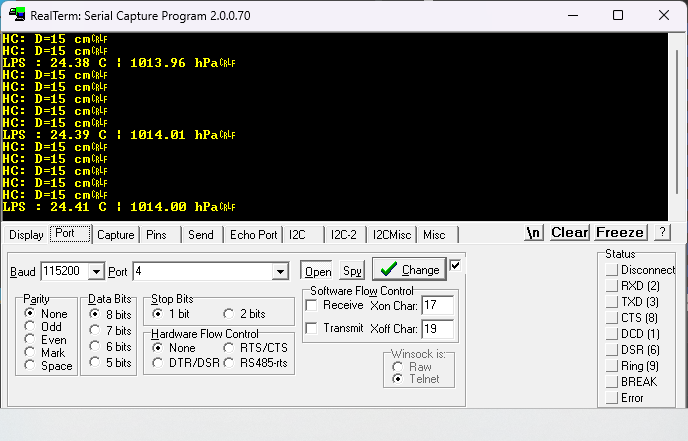
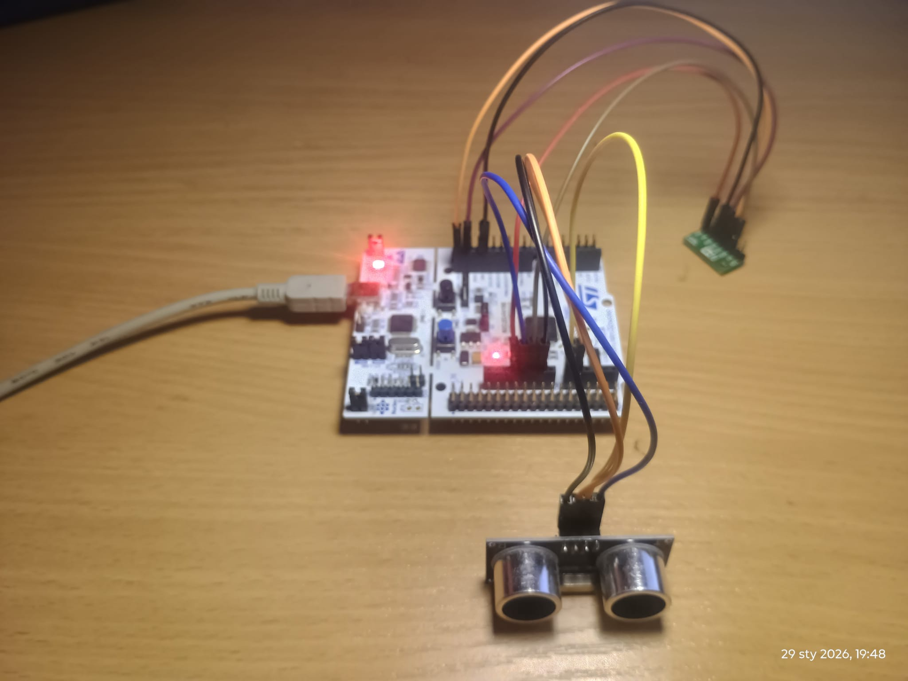

# STM32F411RE Bare-Metal RTOS Platform (WIP)

An educational bare-metal RTOS platform for the **STM32F411RE (Cortex-M4)**, written from scratch in **C + ARM assembly (PendSV)**.  
No HAL. No FreeRTOS.

This repository focuses on learning and demonstrating how a minimal **preemptive RTOS kernel**, **IPC primitives**, and **real peripheral drivers**
work together in a clean project structure and run on real hardware.

> **Status:** actively developed (WIP).  
> The RTOS core is stable (SysTick + PendSV, sleep, mutex, mailbox) and the platform already runs on real hardware with live UART logs and sensor sampling.

---

## Demo (real hardware)

**UART logging output (RealTerm):**  

**Hardware setup (STM32 + sensors):**  

---

## Highlights

### Kernel / RTOS
- **Preemptive Round-Robin scheduler** driven by **SysTick (1 ms)** and **PendSV**
- **Context switching in ASM** (`core/rtos/osPort.s`)
- Thread states:
  - `READY`
  - `SLEEPING`
  - `BLOCKED_MUTEX`
  - `BLOCKED_QUEUE_RX`
  - `BLOCKED_QUEUE_TX`
- `IdleTask` uses **`__WFI()`** to sleep the CPU when no thread is runnable

### IPC
- **Mutex** with atomic block/unblock (lost-wakeup bug fixed)
- **Mailbox “latest sample”** (overwrite semantics, no queue buildup)
- Queue + semaphore stubs available for extension:
  - `osQueue.*`
  - `osSemaphore.*`

### Drivers / Peripherals
- **USART2 TX** logging (single-writer principle via Logger task)
- **I2C1** driver (register-level)
- Integrated sensors:
  - **LPS25HB** over I2C1 (temperature + pressure)
  - **HC-SR04** ultrasonic distance measurement using **TIM2 input capture**

---

## High-level architecture

### Scheduling flow
1. **SysTick (1 ms)** decrements `sleepTime` for sleeping threads and wakes them when it reaches 0.
2. SysTick sets **PendSV** to request a context switch.
3. **PendSV handler** saves the current context, selects the next runnable thread (RR), restores its context, and returns.

### Data flow (pipeline)
Two producer tasks sample sensors and publish data to “latest” mailboxes.  
A single Logger task consumes those samples, converts/formats them, and outputs via UART.
[TaskLPS] ┐
├──> mailbox (latest) ──> [TaskLogger] ──> USART2 TX
[TaskSonar] ┘

**For detailed kernel, scheduler, and IPC design notes, see the documentation in `docs/architecture/`.**

---

## Tasks (current)

- **TaskLPS (producer)**
  - reads raw temperature/pressure from LPS25HB over I2C1
  - publishes `(temp_raw, press_raw)` to the mailbox
  - sleeps ~1000 ms

- **TaskSonar (producer)**
  - triggers HC-SR04, measures echo pulse width via TIM2 input capture
  - performs `median3()` filtering (noise reduction)
  - publishes `distance_cm` to the mailbox

- **TaskLogger (consumer)**
  - receives latest samples from mailboxes
  - converts and formats values
  - prints log lines on USART2 (mutex-protected single writer)

Example log lines:
LPS: 24.40 C | 1014.00 hPa
HC: D=15 cm

---

## Hardware

### Target board
- **STM32F411RE** (e.g., NUCLEO-F411RE)

### Sensor wiring (current setup)

**LPS25HB (I2C1)**
- SCL: PB8
- SDA: PB9
- Speed: 100 kHz

**HC-SR04 (TIM2 Input Capture)**
- TRIG: PA0 (GPIO)
- ECHO: PA1 (TIM2_CH2, AF1)
- TIM2 configured for **1 µs tick** to measure pulse width

---

## Project structure

stm32-baremetal-rtos-demo/
├── README.md
├── docs/
│   └── images/
│       ├── uart_log.png
│       └── hardware_setup.png
├── core/
│   ├── rtos/
│   │   ├── osKernel.c/.h
│   │   ├── osPort.s
│   │   └── ipc/
│   │       ├── osMutex.c/.h
│   │       ├── osQueue.c/.h
│   │       ├── osSemaphore.c/.h
│   │       └── osMailbox.c/.h
│   ├── drivers/
│   │   ├── bus/
│   │   │   ├── usart/usart2.c/.h
│   │   │   └── i2c/i2c.c/.h
│   │   └── sensors/
│   │       ├── hc_sr04/hc_sr04.c/.h
│   │       └── lps25hb/lps25hb.c/.h
│   └── app/
│       ├── app.c/.h
│       └── log/log.c/.h
├── platform/
│   └── stm32f411/cmsis/
└── ide/
    └── stm32cubeide/

---

## Build & Run

This repository contains a ready-to-import STM32CubeIDE project:

1. Open `ide/stm32cubeide/` in **STM32CubeIDE**
2. Build and flash to the board
3. Open a serial terminal for **USART2**

Recommended serial settings:
- Baudrate: **115200**
- 8N1

> Note: the project intentionally avoids HAL. All peripheral setup is register-level.

---

## Roadmap (planned)
- Documentation improvements (architecture diagrams, design notes)
- CMSIS/platform cleanup and consistent naming
- FIFO queue IPC + optional timeouts
- Optional: thread priorities and alternative scheduling policies
- Additional peripherals (DMA / SPI / more sensors)
- Additional sensor and memory integrations, such as:
  - **ADXL345 / ADXL3xx accelerometer** (SPI or I2C, motion and orientation data)
  - **External EEPROM** (I2C/SPI) for persistent storage and configuration
- Integration of new peripherals as RTOS-driven tasks using the existing IPC model

---
## Background & Inspiration

This project is inspired by a series of advanced embedded systems courses authored by  
**Israel Gbati** (Firmware Engineer, author of *Bare-Metal Embedded C Programming*).

In particular, the following courses provided the conceptual foundation:

- **Embedded Systems Bare-Metal Programming From Ground Up™ (STM32)**
- **Build Your Own Real-Time OS (RTOS) From Ground Up™ on ARM – Part 1**
- **Build Your Own Real-Time OS (RTOS) From Ground Up™ on ARM – Part 2**

These courses focus on understanding ARM Cortex-M internals, low-level programming,
and RTOS kernel design through hands-on implementation rather than framework usage.

This repository is **not a course reproduction**.  
Instead, it represents an **independent implementation and extension** of the ideas learned,
expanded into a practical, hardware-driven RTOS platform that includes:

- real peripheral drivers (UART, I2C, timers),
- inter-task communication used in real workloads,
- bug fixing and design trade-offs beyond the course scope,
- a reusable and scalable project structure suitable for further development.

The project is intentionally developed as a long-term learning platform and portfolio project,
with continuous refactoring, documentation, and feature expansion.

## License
Add a license when you are ready (MIT / Apache-2.0 / etc.).

